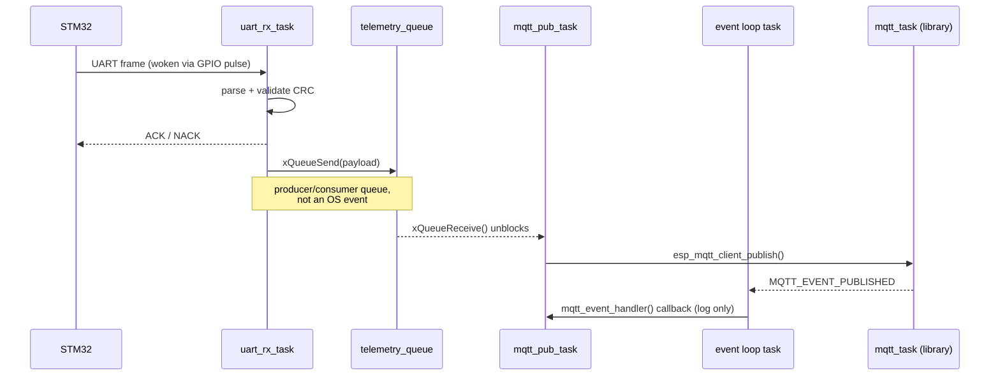
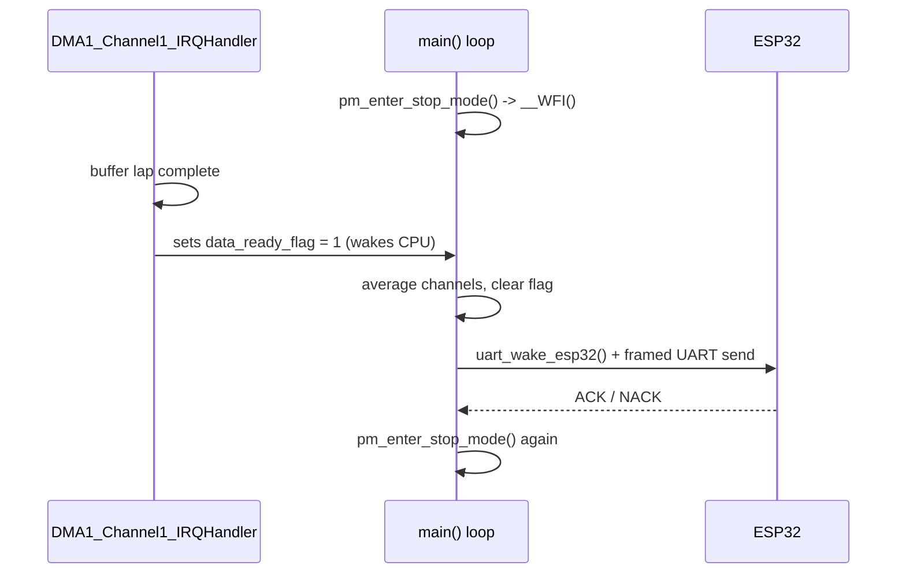
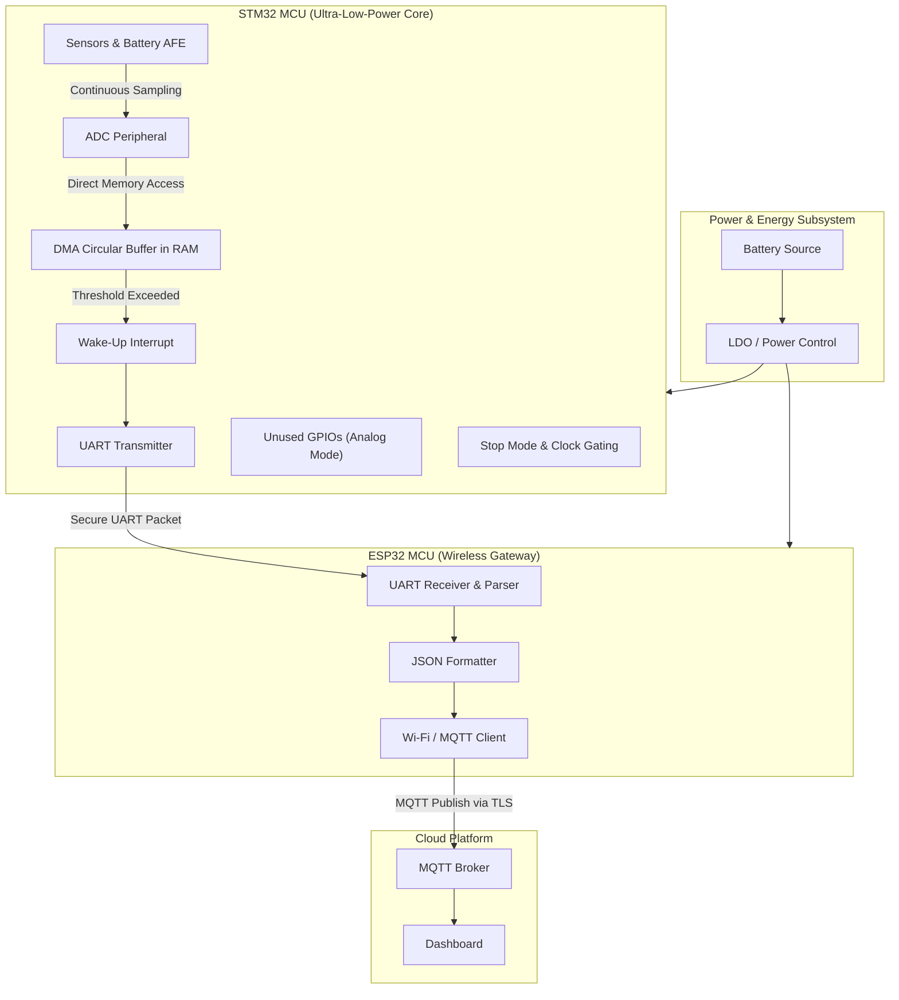

# Ultra-Low-Power Dual-MCU IoT Telemetry Node

This repository contains the firmware for a dual-MCU IoT telemetry node, utilizing an STM32 for ultra-low-power bare-metal peripheral management and data acquisition, and an ESP32 for Wi-Fi/MQTT connectivity.

📖 **[View the full codebase documentation](https://htmlpreview.github.io/?https://github.com/aaabdelaziz/Ultra-Low-Power-Dual-MCU-IoT-Node/blob/main/CODEBASE_DOCUMENTATION.html)** — architecture, state machines, timing diagrams, and register-level details for [`CODEBASE_DOCUMENTATION.html`](CODEBASE_DOCUMENTATION.html) (GitHub does not render raw HTML inline, so use the link above to view it rendered).

## Architecture Overview

### STM32 (MCU 1)
- **Role:** Handles low-level peripherals, sensor/battery data acquisition, and aggressive power management.
- **Power Strategy:** Spends >99% of its time in deep sleep (STOP mode). Uses DMA and circular buffers to sample ADC data in the background without waking the CPU. 
- **Power Optimizations:** 
  - Aggressive peripheral clock gating.
  - Unused GPIOs configured to Analog mode to eliminate leakage currents.
  - Sub-10 µA sleep current target.
- **Communication:** Triggers the ESP32 via UART/GPIO when data is ready to be transmitted. Waits for an ACK before going back to sleep.

### ESP32 (MCU 2)
- **Role:** Handles wireless connectivity, local buffering, and cloud communication via MQTT.
- **Connectivity:** Implemented using ESP-IDF. Connects to a Wi-Fi network and publishes JSON or binary structs to an MQTT broker.
- **Communication:** Remains asleep or in modem-sleep until woken by the STM32. Reads UART frames, validates CRC, and replies with an ACK/NACK.

## Sensor Inputs & Cloud Outputs

### Inputs (STM32 side)

The STM32 samples three analog channels on ADC1, free-running through DMA1 into a circular buffer (`dma_adc.c`), and averages `ADC_BUFFER_DEPTH` (16) samples per channel before each transmission. Values are raw 12-bit ADC codes (0-4095) — no volts/°C conversion is applied anywhere in this firmware; a consumer of the MQTT data (or a future addition to `app/src/main.c`) would need to apply that conversion.

| Channel index | Pin | ADC1 input | Measures                     | `telemetry_payload_t` field |
|---------------|-----|------------|-------------------------------|------------------------------|
| 0             | PA1 | ADC1_IN6   | Battery voltage (via divider) | `battery_mv`                 |
| 1             | PA4 | ADC1_IN9   | Temperature sensor            | `temp_sensor`                |
| 2             | PA5 | ADC1_IN10  | Generic/spare analog input    | `adc_ch1`                    |

Pin/channel numbers are the single source of truth in `stm32_firmware/drivers/include/board_config.h` — change hardware wiring there, not in `dma_adc.c`. Two more fields round out the payload: `timestamp_ms` (currently always `0` — no RTC is configured in this design) and `status_flags` (bit0 = system OK, set every cycle).

### Outputs (ESP32 side)

The ESP32 republishes each validated payload as JSON over MQTT:

- **Topic:** `telemetry/node_1`
- **Broker:** configurable via menuconfig (`CONFIG_ESP_MQTT_BROKER_URI`); defaults to `mqtt://test.mosquitto.org` if unset.
- **Payload:** `{"ts":<uint32>,"batt_mv":<uint16>,"temp":<uint16>,"adc":<uint16>,"status":<uint8>}` — same raw values as the table above, just JSON-formatted in `mqtt_publisher_task()`.

There is also a smaller, non-cloud-facing output: for every frame it receives, the ESP32 sends a single ACK (`0x06`) or NACK (`0x15`) byte back to the STM32 over the same UART link, which is what `uart_send_telemetry_and_wait_ack()` on the STM32 side blocks on.

## Low-Power Operation

Only the STM32 side implements explicit low-power control in this repository. The ESP32 side relies on ESP-IDF's own Wi-Fi power-save behavior and does not currently call any explicit sleep API — see the comment in `main.cpp`'s idle loop.

### STM32 duty cycle

The STM32 spends the overwhelming majority of its time in **STOP 2** (the deepest RAM-retention sleep mode STM32L4 offers) and only wakes briefly to move data:

1. **Boot, once:** `pm_init()` enables the PWR peripheral clock; `pm_configure_unused_gpios_analog()` sets every GPIOA pin to Analog mode (eliminating Schmitt-trigger leakage current on floating pins) and then re-opens only the pins this firmware actually drives (the wake pin, USART2 TX/RX); `pm_disable_unused_clocks()` is a documented no-op today, kept as the one auditable place to gate off a future driver's clock; `systick_delay_init()` brings up the millisecond delay primitive used later; then `uart_handshake_init()` and `dma_adc_init()` bring up the peripherals.
2. **Free-running acquisition:** `dma_adc_start()` arms DMA1 and starts ADC1's continuous 3-channel scan. From here, new samples land in the circular buffer entirely in hardware — the CPU is not involved until a full lap completes.
3. **Sleep:** the main loop calls `pm_enter_stop_mode()`, which selects STOP 2 and executes `__WFI()`, halting the core.
4. **Wake:** the only interrupt enabled to break STOP 2 is DMA1's transfer-complete interrupt, which fires once per full lap of the circular buffer and just sets a flag — no work happens in interrupt context.
5. **Back in the main loop:** the flag is seen, each channel is averaged, a `telemetry_payload_t` is packaged, the ESP32 is pulsed awake, the framed/CRC'd payload is sent and ACKed, and the loop calls `pm_enter_stop_mode()` again.

### Why this is low-power

- **No busy-polling for samples.** ADC1+DMA1 free-run in hardware while the CPU sleeps; the CPU wakes once per full buffer lap, not once per sample.
- **No floating-pin leakage.** Every unused GPIOA pin is forced to Analog mode at boot.
- **Deepest retention sleep available.** STOP 2 keeps SRAM/register state (no re-init on wake) while cutting core, most clocks, and most peripherals.
- **Minimal clock footprint.** Only the peripherals actually used (PWR, GPIOA, ADC, DMA1, USART2, SysTick) are ever clocked.
- **Communication is bursty, not continuous.** The ESP32 and its power-hungry Wi-Fi radio are only woken for the few tens of milliseconds it takes to transmit one payload and get an ACK.

## Scheduler & Task Architecture

### ESP32 side: FreeRTOS, preemptive priority scheduler

This project creates 2 of its own tasks; ESP-IDF's Wi-Fi driver and the MQTT client library each spawn their own internal task too, so 4 tasks are active in total once running.

| Task | Entry function | Priority | Stack | Created | Blocks on |
|---|---|---|---|---|---|
| `uart_rx_task` | `uart_receiver_task()` | 5 | 4096 | `main.cpp` via `xTaskCreate` | `uart_read_bytes()`, 20-tick (~20ms) timeout |
| `mqtt_pub_task` | `mqtt_publisher_task()` | 4 | 4096 | `main.cpp` via `xTaskCreate` | `xQueueReceive(..., portMAX_DELAY)` |
| `mqtt_task` (library) | `esp_mqtt_task()` | ESP-IDF default | library-configured | internally by `esp_mqtt_client_start()` inside `wifi_mqtt_init()` | MQTT socket I/O |
| Wi-Fi driver task | internal to `esp_wifi` | ESP-IDF default | library-configured | internally by `esp_wifi_init()`/`esp_wifi_start()` | Wi-Fi driver events |

Priority rationale (`main.cpp`, comment above the `xTaskCreate` calls): `uart_rx_task` outranks `mqtt_pub_task` (5 vs 4) because a late UART read risks losing bytes or dropping a whole frame, while a late MQTT publish just delays telemetry rather than losing it.

FreeRTOS on ESP32 is preemptive: whichever *ready* task has the highest priority runs, and a higher-priority task that becomes ready immediately preempts a lower-priority one. Both app tasks spend nearly all their time blocked, not running:

- `uart_rx_task` is not purely event-driven — `uart_read_bytes()`'s 20-tick timeout means it wakes and checks roughly every 20ms even with nothing to parse, then goes back to blocking.
- `mqtt_pub_task` is purely event-driven — `portMAX_DELAY` means it only becomes ready when `uart_rx_task` calls `xQueueSend()`.

### Event handling between tasks (ESP32)

Two distinct hand-off mechanisms — don't conflate them:

1. **Application data hand-off — a queue.** `telemetry_queue`, created once in `main.cpp` (`xQueueCreate(10, sizeof(telemetry_payload_t))`), is the one channel connecting the two app tasks: `uart_rx_task` calls `xQueueSend()` in `uart_receiver.cpp`, which unblocks `mqtt_pub_task`'s `xQueueReceive()` in `wifi_mqtt_client.cpp`. This is a direct task-to-task producer/consumer link.
2. **Driver/system async notification — the ESP-IDF event loop.** `wifi_event_handler()` and `mqtt_event_handler()` are not called by either app task directly — they're callbacks registered with `esp_event_handler_instance_register()` / `esp_mqtt_client_register_event()` in `wifi_mqtt_init()`, and run on the default event loop's own task whenever the Wi-Fi driver or MQTT library posts an event (`WIFI_EVENT_STA_DISCONNECTED`, `IP_EVENT_STA_GOT_IP`, `MQTT_EVENT_CONNECTED`, ...). Neither app task blocks waiting on these; it's fire-and-forget pub/sub, not a queue between two tasks this project wrote.



### STM32 side: no scheduler — superloop + a single interrupt

No RTOS, so there is no task table to draw. Only two execution contexts exist:

- **Main loop** (`app/src/main.c`), running forever — this is the entire "schedule."
- **`DMA1_Channel1_IRQHandler`** (`dma_adc.c`) — the only interrupt this firmware enables anywhere. `NVIC_EnableIRQ(DMA1_Channel1_IRQn)` is called with no explicit `NVIC_SetPriority()`, and it is the only `NVIC_EnableIRQ()` call in the whole project — SysTick never enables `TICKINT` (`systick_delay_init()` only sets `CLKSOURCE`/`ENABLE`, so `delay_ms()` polls `COUNTFLAG` instead of interrupting). With one interrupt source, priority-level reasoning is moot: there is nothing for it to preempt or be preempted by.

The hand-off between the ISR and the main loop is the direct STM32 analogue of the ESP32's queue, just far simpler because there is only one producer, one consumer, and one bit of information: `data_ready_flag`, `volatile`, set only in the ISR, read/cleared only in the main loop (`dma_adc.c`). No queue primitive is needed or available bare-metal; a single-byte flag is sufficient because the write is atomic on Cortex-M4 and there is exactly one writer per side.



## Repository Structure

```
├── common/
│   └── protocol_spec.h              # Shared frame/payload structs + CRC16 — the wire format both MCUs agree on
├── esp32_firmware/
│   ├── CMakeLists.txt                # ESP-IDF project bootstrap
│   ├── main/
│   │   ├── CMakeLists.txt
│   │   └── main.cpp                   # Composition root: creates the queue, starts both components' tasks
│   └── components/                    # Active ESP-IDF components (auto-discovered by the build)
│       ├── uart_receiver/
│       │   ├── include/uart_receiver.h
│       │   └── uart_receiver.cpp      # Parses STM32 UART frames, validates CRC, ACK/NACKs, queues valid payloads
│       └── wifi_mqtt_client/
│           ├── include/wifi_mqtt_client.h
│           └── wifi_mqtt_client.cpp   # Wi-Fi + MQTT client; drains the queue and publishes JSON telemetry
└── stm32_firmware/
    ├── CMakeLists.txt                 # Bare-metal ARM GCC cross-compile configuration
    ├── app/src/main.c                 # Composition root: sense -> transmit -> sleep loop
    ├── drivers/
    │   ├── include/ + src/board_config.h       # Single source of truth for pin/channel assignments
    │   ├── include/ + src/power_manager.[ch]   # Clock gating, GPIO leakage elimination, STOP2 sleep entry
    │   ├── include/ + src/dma_adc.[ch]         # Free-running ADC1+DMA1 circular-buffer sampling/averaging
    │   └── include/ + src/systick_delay.[ch]   # Blocking millisecond delay primitive
    ├── middleware/include/ + src/uart_handshake.[ch]  # Frames/sends telemetry over USART2, waits for ACK
    └── CMSIS/                          # Vendored ARM CMSIS + ST device headers, not project code
```

> **Note:** `esp32_firmware/uart_receiver/`, `esp32_firmware/wifi_mqtt_client/`, and `esp32_firmware/main.cpp` (at the `esp32_firmware/` root) are older duplicates left over from before the code was split into ESP-IDF `components/` — they are not referenced by any `CMakeLists.txt` and are not part of the actual build. Edit the copies under `components/` and `main/` instead.

## Module Reference

What each module is responsible for producing:

| Module                                             | What it produces                                                                                                   |
|-----------------------------------------------------|-----------------------------------------------------------------------------------------------------------------------|
| `common/protocol_spec.h`                             | The shared UART wire format both MCUs compile against: `telemetry_payload_t`, `uart_frame_t`, sync/ACK/NACK byte constants, and `calculate_crc16()`. |
| `stm32_firmware/drivers/board_config.h`              | The one pin/ADC-channel mapping every other STM32 module reads. No functions — just the hardware-to-name mapping.   |
| `stm32_firmware/drivers/power_manager.[ch]`          | Low-power state transitions: clock gating, GPIO leakage elimination, and STOP 2 sleep entry/exit.                    |
| `stm32_firmware/drivers/dma_adc.[ch]`                | Averaged 12-bit ADC readings per channel, from a free-running ADC1+DMA1 pipeline the CPU does not service per-sample. |
| `stm32_firmware/drivers/systick_delay.[ch]`          | A blocking millisecond delay (`delay_ms()`), used for the ESP32 wake-pulse timing and ADC regulator settle waits.     |
| `stm32_firmware/middleware/uart_handshake.[ch]`      | A validated, CRC-checked, ACK-waited UART transmission of one `telemetry_payload_t` to the ESP32.                     |
| `stm32_firmware/app/src/main.c`                      | The STM32-side composition root: the sense -> transmit -> sleep loop that calls everything above, in order.          |
| `esp32_firmware/components/uart_receiver`            | A stream of validated `telemetry_payload_t` values, parsed byte-by-byte from the STM32's framed UART stream and pushed onto a FreeRTOS queue. |
| `esp32_firmware/components/wifi_mqtt_client`         | Wi-Fi connectivity plus MQTT-published JSON telemetry on the cloud broker, drained from that same queue.              |
| `esp32_firmware/main/main.cpp`                       | The ESP32-side composition root: creates the queue and starts both components' FreeRTOS tasks.                       |

## Documentation

Detailed design and implementation documents are in the `docs/` directory:

- [Implementation Plan](docs/1_implementation_plan.md): Followed design implementation tasks, acceptance criteria, and open questions.
- [Implementation Steps](docs/2_Steps.md): Phase-by-phase step list for the common layer, STM32 low-power firmware, ADC/DMA pipeline, handshake, and ESP32 MQTT pipeline.
- [Architecture](docs/3_Architecture.md): System architecture diagram (Mermaid) and component interactions.
- [Software Design](docs/SOFTWARE_DESIGN.md): Expanded software design, data flow, task architecture, and operational notes.

## Architecture Diagram



## Protocol Specifications

The communication between the STM32 and ESP32 uses a custom, lightweight UART framing protocol.
- **Sync Bytes:** `0xAA`, `0x55`
- **Length:** 2 bytes (payload size)
- **Payload:** Packed C-struct containing timestamp, battery voltage, temperature, and flags.
- **CRC:** 16-bit CRC (CCITT-FALSE) for data integrity.

## Detailed Build & Flash Instructions

### 0. Environment Setup (macOS)
If you are starting from a fresh environment, a setup script has been provided to automatically install all necessary toolchains via Homebrew (including ARM GCC, CMake, OpenOCD, ST-Link, and the ESP-IDF).

Run the setup script from the root of the repository:
```bash
chmod +x setup_env.sh
./setup_env.sh
```

### 1. STM32 Firmware (Bare-Metal)

#### Prerequisites
- **ARM GNU Toolchain**: Make sure `arm-none-eabi-gcc` is installed and added to your system PATH.
- **CMake & Make**: Required to generate build files and compile the source code.
- **Flashing Tool**: A tool like OpenOCD, ST-Link utility (`st-flash`), or STM32CubeProgrammer to load the `.bin` or `.hex` file onto the microcontroller.

#### Build Steps
1. Navigate to the STM32 firmware directory:
   ```bash
   cd stm32_firmware
   ```
2. Create a build directory and generate Makefiles:
   ```bash
   mkdir build && cd build
   cmake ..
   ```
   > **Note:** If you are using a specific STM32 family (e.g. STM32G0), you must edit `stm32_firmware/CMakeLists.txt` to adjust the `-mcpu=` flag and provide the correct linker script (`.ld`) and startup assembly file (`.s`) before compiling.
3. Compile the project:
   ```bash
   make
   ```
   This will generate `main.elf`, `main.bin`, and `main.hex` in the `build/` directory.

#### Flashing the STM32
Depending on your programmer (e.g., ST-Link), use one of the following commands:
- **Using ST-Link (st-flash):**
  ```bash
  st-flash write main.bin 0x08000000
  ```
- **Using OpenOCD:**
  ```bash
  openocd -f interface/stlink.cfg -f target/stm32l4x.cfg -c "program main.bin exit 0x08000000"
  ```

---

### 2. ESP32 Firmware (Connectivity)

#### Prerequisites
- **ESP-IDF v5.x**: The official Espressif IoT Development Framework must be installed and sourced in your terminal environment.

#### Build Steps
1. Open a terminal where ESP-IDF is sourced (`get_idf` or `. ./export.sh`).
2. Navigate to the ESP32 firmware directory:
   ```bash
   cd esp32_firmware
   ```
3. Set the target chip (e.g., `esp32`, `esp32s3`, `esp32c3`):
   ```bash
   idf.py set-target esp32
   ```
4. **Configuration (Crucial Step):**
   Run the menuconfig tool to set up your specific Wi-Fi credentials and MQTT broker.
   ```bash
   idf.py menuconfig
   ```
   *Navigate to the custom configuration sections (if defined) or modify the macros directly in `wifi_mqtt_client.cpp` if bypassing menuconfig.*
5. Build the project:
   ```bash
   idf.py build
   ```

#### Flashing & Monitoring the ESP32
Connect your ESP32 via USB. The flashing tool usually auto-detects the serial port.
```bash
idf.py flash monitor
```
*The `monitor` command opens a serial console so you can watch the ESP32 connect to Wi-Fi, connect to the MQTT broker, and log incoming UART telemetry data.*

## Running the System
1. **Hardware Connection:** Connect the designated UART TX pin of the STM32 to the UART RX pin of the ESP32 (and RX to TX), ensuring both share a common Ground (GND). If they operate at different logic levels (e.g., 5V vs 3.3V), use a logic level shifter.
2. **Power Up:** Power both microcontrollers.
3. **Operation:** The STM32 will remain asleep, wake up to capture sensor data via DMA, wake the ESP32 via UART, transmit the data payload, and wait for an ACK. The ESP32 will parse this data, calculate the CRC, reply with an ACK, and forward the data to the configured MQTT broker.

## MISRA-C & Industry Best Practices
The STM32 firmware is written following embedded industry best practices, utilizing lightweight register-level manipulation for critical power paths to avoid HAL bloat, while maintaining clear, modular code abstraction.
