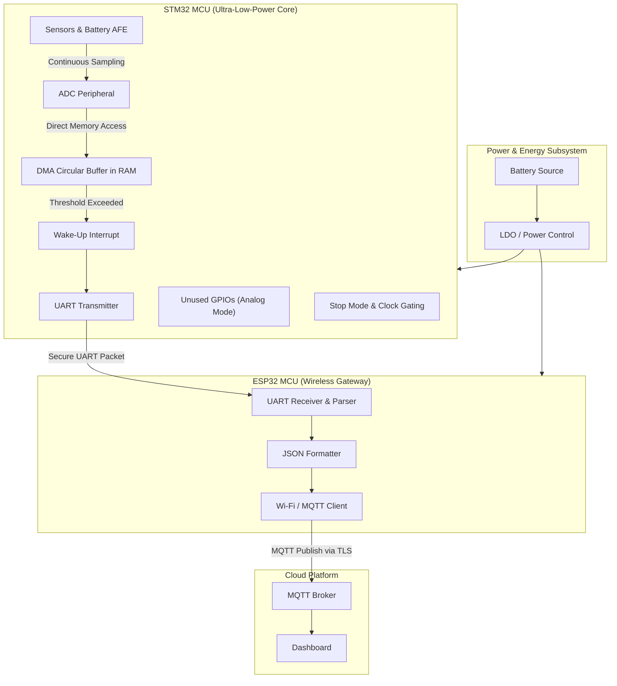

# Ultra-Low-Power Dual-MCU IoT Telemetry Node

This repository contains the firmware for a dual-MCU IoT telemetry node, utilizing an STM32 for ultra-low-power bare-metal peripheral management and data acquisition, and an ESP32 for Wi-Fi/MQTT connectivity.

## Architecture Overview

### STM32 (MCU 1)
- **Role:** Handles low-level peripherals, sensor/battery data acquisition, and aggressive power management.
- **Power Strategy:** Spends >99% of its time in deep sleep (STOP mode). Uses DMA and circular buffers to sample ADC data in the background without waking the CPU. 
- **Power Optimizations:** 
  - Aggressive peripheral clock gating.
  - Unused GPIOs configured to Analog mode to eliminate leakage currents.
  - Sub-10 µA sleep current target.
- **Communication:** Triggers the ESP32 via UART/GPIO when data is ready to be transmitted. Waits for an ACK before going back to sleep.

### ESP32 (MCU 2)
- **Role:** Handles wireless connectivity, local buffering, and cloud communication via MQTT.
- **Connectivity:** Implemented using ESP-IDF. Connects to a Wi-Fi network and publishes JSON or binary structs to an MQTT broker.
- **Communication:** Remains asleep or in modem-sleep until woken by the STM32. Reads UART frames, validates CRC, and replies with an ACK/NACK.

## Repository Structure

```
├── common/
│   └── protocol_spec.h      # Shared structs, framing protocol, and CRC definition
├── esp32_firmware/
│   ├── CMakeLists.txt       # ESP-IDF project configuration
│   └── main/                # ESP32 FreeRTOS application
│       ├── CMakeLists.txt
│       ├── main.cpp
│       ├── uart_receiver.cpp
│       ├── uart_receiver.h
│       ├── wifi_mqtt_client.cpp
│       └── wifi_mqtt_client.h
└── stm32_firmware/
   ├── CMakeLists.txt       # STM32 CMake configuration
   ├── include/             # STM32 headers
   │   ├── dma_adc.h
   │   ├── power_manager.h
   │   └── uart_handshake.h
   └── src/                 # STM32 bare-metal C source code
      ├── dma_adc.c
      ├── main.c
      ├── power_manager.c
      └── uart_handshake.c
```

## Documentation

Detailed design and implementation documents are in the `docs/` directory:

- [Implementation Plan](docs/1_implementation_plan.md): Followed design implementation tasks, acceptance criteria, and open questions.
- [Implementation Steps](docs/2_Steps.md): Phase-by-phase step list for the common layer, STM32 low-power firmware, ADC/DMA pipeline, handshake, and ESP32 MQTT pipeline.
- [Architecture](docs/3_Architecture.md): System architecture diagram (Mermaid) and component interactions.
- [Software Design](docs/SOFTWARE_DESIGN.md): Expanded software design, data flow, task architecture, and operational notes.

## Architecture Diagram



## Protocol Specifications

The communication between the STM32 and ESP32 uses a custom, lightweight UART framing protocol.
- **Sync Bytes:** `0xAA`, `0x55`
- **Length:** 2 bytes (payload size)
- **Payload:** Packed C-struct containing timestamp, battery voltage, temperature, and flags.
- **CRC:** 16-bit CRC (CCITT-FALSE) for data integrity.

## Detailed Build & Flash Instructions

### 0. Environment Setup (macOS)
If you are starting from a fresh environment, a setup script has been provided to automatically install all necessary toolchains via Homebrew (including ARM GCC, CMake, OpenOCD, ST-Link, and the ESP-IDF).

Run the setup script from the root of the repository:
```bash
chmod +x setup_env.sh
./setup_env.sh
```

### 1. STM32 Firmware (Bare-Metal)

#### Prerequisites
- **ARM GNU Toolchain**: Make sure `arm-none-eabi-gcc` is installed and added to your system PATH.
- **CMake & Make**: Required to generate build files and compile the source code.
- **Flashing Tool**: A tool like OpenOCD, ST-Link utility (`st-flash`), or STM32CubeProgrammer to load the `.bin` or `.hex` file onto the microcontroller.

#### Build Steps
1. Navigate to the STM32 firmware directory:
   ```bash
   cd stm32_firmware
   ```
2. Create a build directory and generate Makefiles:
   ```bash
   mkdir build && cd build
   cmake ..
   ```
   > **Note:** If you are using a specific STM32 family (e.g. STM32G0), you must edit `stm32_firmware/CMakeLists.txt` to adjust the `-mcpu=` flag and provide the correct linker script (`.ld`) and startup assembly file (`.s`) before compiling.
3. Compile the project:
   ```bash
   make
   ```
   This will generate `main.elf`, `main.bin`, and `main.hex` in the `build/` directory.

#### Flashing the STM32
Depending on your programmer (e.g., ST-Link), use one of the following commands:
- **Using ST-Link (st-flash):**
  ```bash
  st-flash write main.bin 0x08000000
  ```
- **Using OpenOCD:**
  ```bash
  openocd -f interface/stlink.cfg -f target/stm32l4x.cfg -c "program main.bin exit 0x08000000"
  ```

---

### 2. ESP32 Firmware (Connectivity)

#### Prerequisites
- **ESP-IDF v5.x**: The official Espressif IoT Development Framework must be installed and sourced in your terminal environment.

#### Build Steps
1. Open a terminal where ESP-IDF is sourced (`get_idf` or `. ./export.sh`).
2. Navigate to the ESP32 firmware directory:
   ```bash
   cd esp32_firmware
   ```
3. Set the target chip (e.g., `esp32`, `esp32s3`, `esp32c3`):
   ```bash
   idf.py set-target esp32
   ```
4. **Configuration (Crucial Step):**
   Run the menuconfig tool to set up your specific Wi-Fi credentials and MQTT broker.
   ```bash
   idf.py menuconfig
   ```
   *Navigate to the custom configuration sections (if defined) or modify the macros directly in `wifi_mqtt_client.cpp` if bypassing menuconfig.*
5. Build the project:
   ```bash
   idf.py build
   ```

#### Flashing & Monitoring the ESP32
Connect your ESP32 via USB. The flashing tool usually auto-detects the serial port.
```bash
idf.py flash monitor
```
*The `monitor` command opens a serial console so you can watch the ESP32 connect to Wi-Fi, connect to the MQTT broker, and log incoming UART telemetry data.*

## Running the System
1. **Hardware Connection:** Connect the designated UART TX pin of the STM32 to the UART RX pin of the ESP32 (and RX to TX), ensuring both share a common Ground (GND). If they operate at different logic levels (e.g., 5V vs 3.3V), use a logic level shifter.
2. **Power Up:** Power both microcontrollers.
3. **Operation:** The STM32 will remain asleep, wake up to capture sensor data via DMA, wake the ESP32 via UART, transmit the data payload, and wait for an ACK. The ESP32 will parse this data, calculate the CRC, reply with an ACK, and forward the data to the configured MQTT broker.

## MISRA-C & Industry Best Practices
The STM32 firmware is written following embedded industry best practices, utilizing lightweight register-level manipulation for critical power paths to avoid HAL bloat, while maintaining clear, modular code abstraction.
